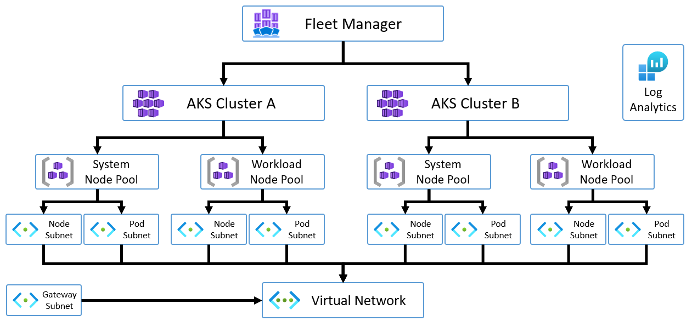
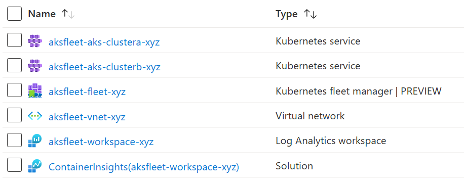

# AKS Fleet Manager Demo

  
`Estimated deployment time: 30 minutes`  
**Click 'Deploy to Azure' to open the Azure Portal with this template loaded!**

## Description:
This demo will deploy 2x AKS Clusters and connect them both to a single Fleet Manager. Once deployed, you can give yourself the `Azure Kubernetes Service RBAC Cluster Admin` and `Azure Kubernetes Fleet Manager RBAC Cluster Admin` within the Resource Group to connect to Fleet Manager.

See the Links section below for further infomation on deploying workloads to Fleet Manager.

As noted above, deployment may take up to 30 minutes

## Features:
- System & Workload (User) Node Pools on each AKS Cluster
- Single VNet, individual Node & Pod Subnets per Node Pool
- Azure AD RBAC enabled on all Clusters
- All member Cluster configuration is stored within `config.json`

## Architecture:

## Azure Resource List:

**Note:** *4 additional Resource Groups will be created, 2x by AKS for the compute (MC_xyz) and 2x by Fleet Manager for hub & compute (FL_xyz & MC_FL_xyz)*

## Links:
- [Architectural overview of Azure Kubernetes Fleet Manager](https://learn.microsoft.com/en-us/azure/kubernetes-fleet/architectural-overview)
- [Propagate Kubernetes resource objects from an Azure Kubernetes Fleet Manager resource to member clusters](https://learn.microsoft.com/en-us/azure/kubernetes-fleet/configuration-propagation)
- [Set up multi-cluster layer 4 load balancing across Azure Kubernetes Fleet Manager member clusters](https://learn.microsoft.com/en-us/azure/kubernetes-fleet/l4-load-balancing)