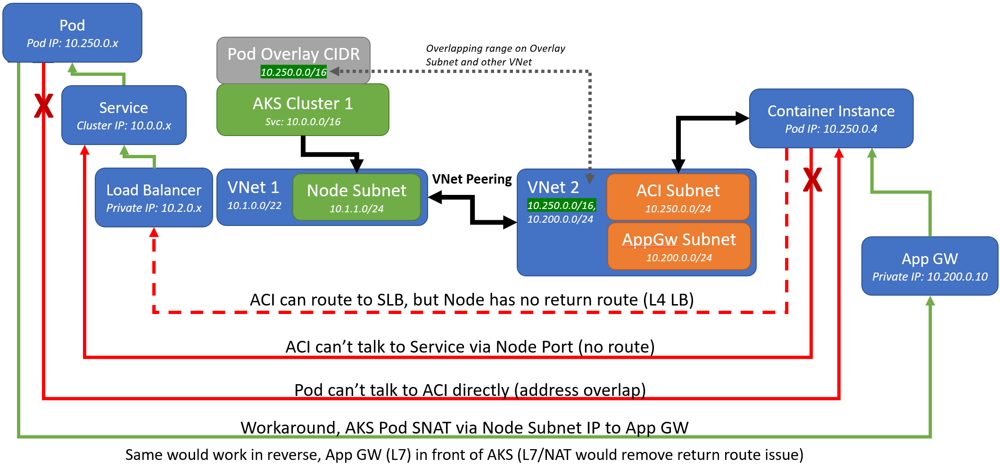
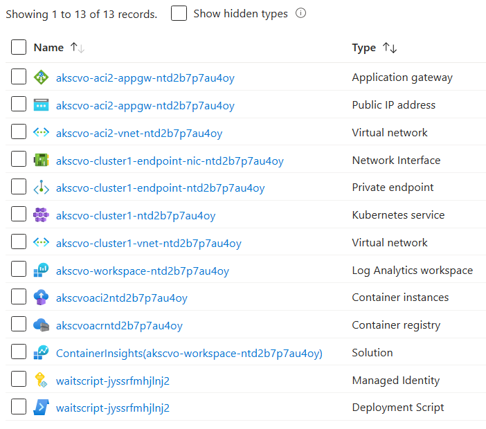

# AKSPodSubnetOverlap

  
`Estimated deployment time: 15 minutes`  
**Click 'Deploy to Azure' to open the Azure Portal with this template loaded!**

## Description:

## How to test green paths:
### ACI to AKS Pod
- Open the Private Endpoint and make note of the Private IP
- Open the Application Gateway and navigate to it's public ip on port 80 (http)
- Place the Private Endpoint's Private IP as a url into the UI pointing to the path `/ping`. Eg: `http://10.1.1.9/ping`

### AKS Pod to ACI
- Open the Application Gateway and make note of the Private IP
- Open the AKS Cluster, navigate to 'Services', and open the External IP listed next to `pathtester-external` in a new tab
- Place the App Gateway's Private IP as a url into the UI pointing to the path `/ping`. Eg: `http://10.200.0.20/ping`

## Azure Resources:
