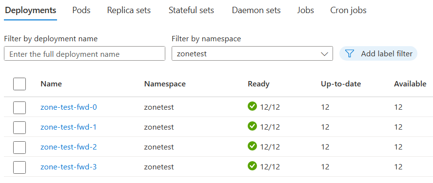
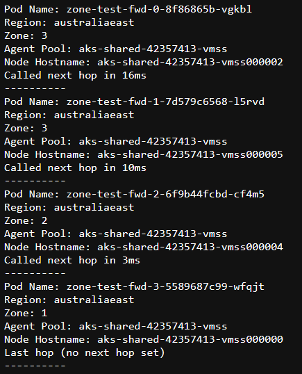
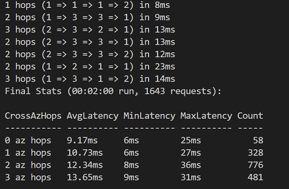

# AKS Zone Test

  
`Estimated deployment time: 8 minutes`  
**Click 'Deploy to Azure' to open the Azure Portal with this template loaded!**

## Description:
This is a small test scenario to show routing between an application deployed to multiple AZ's.

**While you can deploy to regions without AZ's, the tests will not work as designed**

## Resources ([Bicep Template](deploy.bicep))  

The template deploys the following resources:
 - VNet & Log Analytics
 - AKS Cluster with 2 Node Pools (System + User) 
 - Azure Container Registry (with build task for Dockerfile in src)
 - Kube deployement & services (using the image built above) deployed 4 times, set up so one points to another ( 0 => 1 => 2 => 3 )

  
  

## Service ([ASP.NET Core, .NET 7](src/))

The service is designed to show details of where it is hosted, and then make a call to the next service in the chain.  
(*Note: The latency is shown as round trip, eg, the first "Called next hop in Xms" represents the time it took from start of request till complete response.*)

  

## Test Script ([Powershell](quick-test.ps1))
Also included is a powershell test script that you can use to make multiple calls to the service exposed and gather details about the number of zone hops and latency.

  