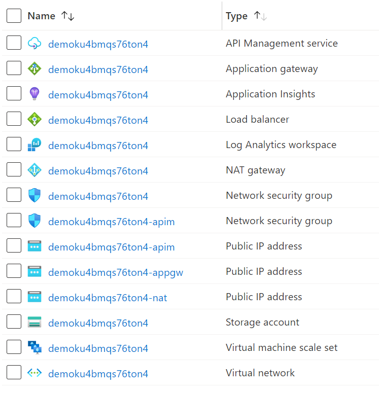

# API-M to SLB & AppGW Demo

## Description

This is a small demo to show the load pattern difference due to keep-alive & TCP sessions when using a Standard Load Balancer (SLB) behind API-M, vs using Application Gateway (AppGW)

## Resources

