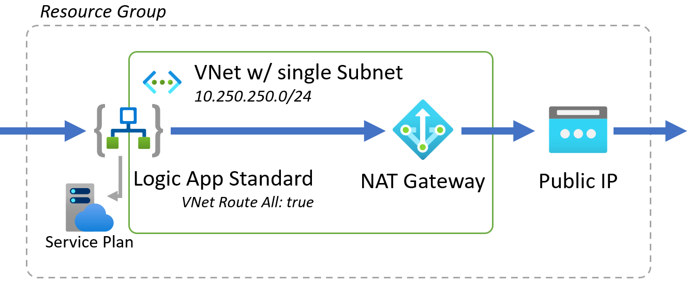
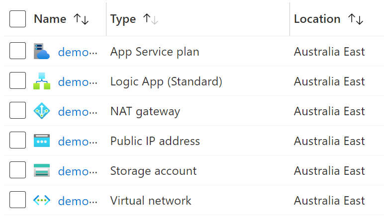

# Logic App Standard with NAT Gateway

This sample template shows how to deploy a [Logic App Standard](https://docs.microsoft.com/en-us/azure/logic-apps/single-tenant-overview-compare#logic-app-standard-resource) with a single fixed outbound IP using [VNet integration](https://docs.microsoft.com/en-us/azure/logic-apps/secure-single-tenant-workflow-virtual-network-private-endpoint#set-up-outbound-traffic-using-vnet-integration) and an [Azure NAT Gateway](https://docs.microsoft.com/en-us/azure/virtual-network/nat-gateway/nat-overview). 

All traffic from the Logic App is routed via the attached VNet and out via the NAT Gateway. In this example a single Public IP is attached, but this could be modified to deploy multiple Public IP's, or an [Azure Public IP Prefix](https://docs.microsoft.com/en-us/azure/virtual-network/ip-services/public-ip-address-prefix).

A default workflow is deployed ([workflow.json](workflow/GetIP/workflow.json)) that will retrieve the outbound public IP of the Logic App via https://api.ipify.org/. This workflow can be triggered via the Azure Portal once deployed (Logic App -> Workflows -> 'GetIP' workflow -> Navigate to the Workflow URL).

