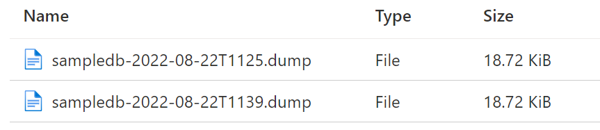
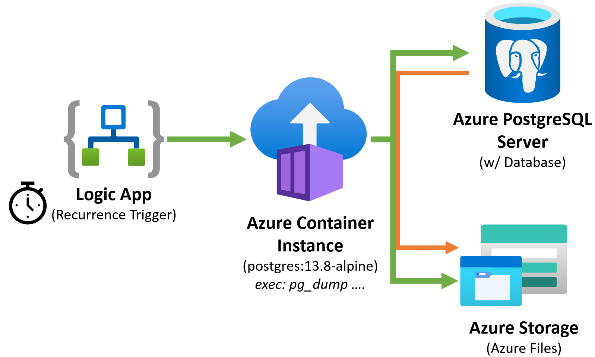
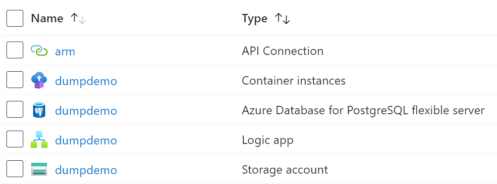

# PG_Dump ACI

This is a small demo using an Azure Container Instance (ACI) to execute pg_dump, writing to an Azure File's share. The ACI Container Group can either be manually started, or a recurring Logic App can start it for scheduled dumps.

_Note: The first execution of the Logic App may fail if the role assignment/permission hasn't propogated._

Each dump is written to the Storage Account with a timestamped name:

## Logical Overview

## Azure Resource List

_+ RBAC Role & Assignment not shown in the list above_